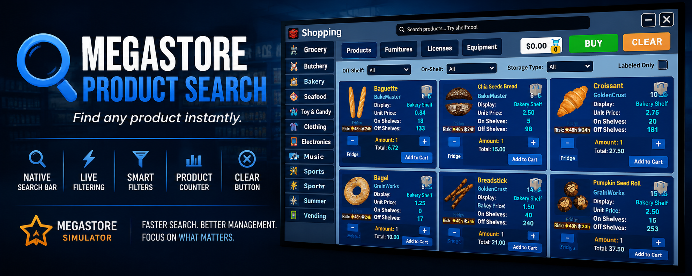

# Megastore Product Search



Adds a native Unity search bar to the Products window with live filtering, smart search commands, a clear button, and product count display.

---

## Features

- Native Unity UI search bar
- Live filtering while typing
- Smart search filters
- Product count display
- Clear button
- Supports localized product names


---

## Search Examples

| Search | Description |
|---------|-------------|
| `milk` | Find products containing "milk" |
| `shelf:cool` | Show products stored on cool shelves |
| `group:bakery` | Show bakery products |
| `department:bakery` | Same as group search |
| `license:3` | Show products requiring License 3 |
| `lic:2` | Short version of license search |

Multiple search terms can also be combined.

Example:

```text
license:3 shelf:cool
```
---

## Installation

### Requirements

- BepInEx

### Install

1. Download `MegastoreProductSearch.dll`
2. Place it inside:

```text
BepInEx/plugins
```

3. Launch the game.

---

## Current Version

**v1.0.0**

---

## Source Code

The complete source code is included in this repository.

---

## Feedback

If you find any bugs or have ideas for future improvements, feel free to open an Issue on GitHub.

---

Created by **RocketKitten**
